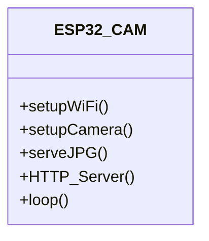
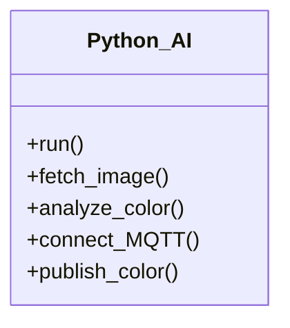
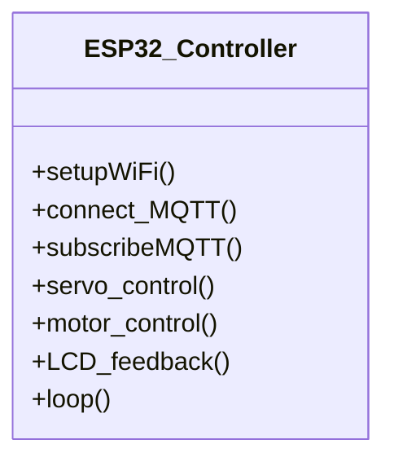
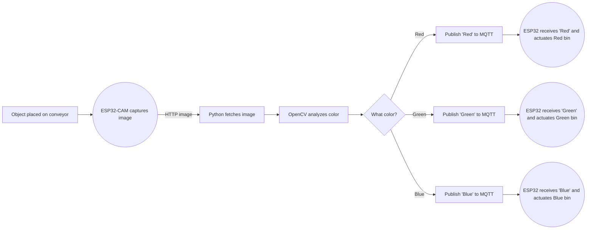
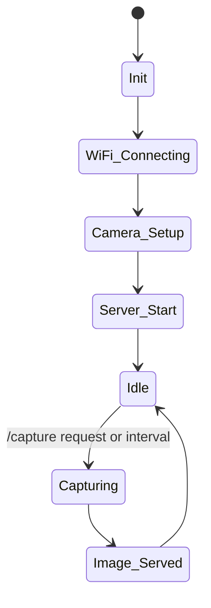
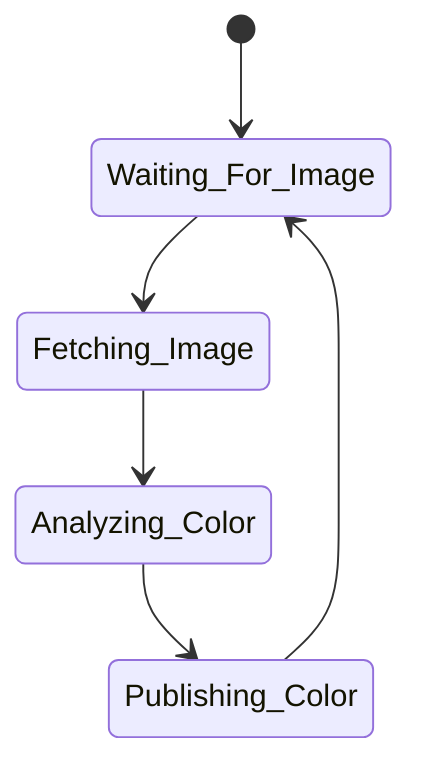
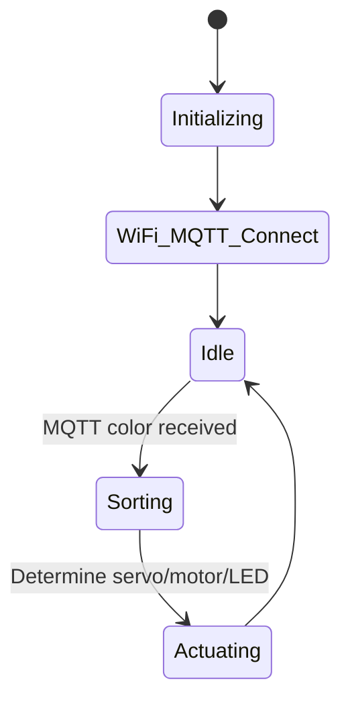

# AI-Driven IoT Conveyor System for Real-Time Color Based Object Sorting

**Abstract:**
This study presents an intelligent, real-time color-based sorting conveyor system founded on Internet of Things (IoT) and artificial intelligence (AI) technologies. The framework integrates an ESP32-CAM for continuous visual capture, an ESP32 microcontroller for hardware management, and an edge-computing Python module for AI-powered color analysis. Captured images are wirelessly transmitted from the ESP32-CAM to a Python application that employs OpenCV computer vision techniques for color identification. The results are communicated via secure MQTT (TLS) to the ESP32, which orchestrates conveyor and servo actions to physically sort objects by detected color. The system’s modular design ensures robust, scalable operation and cost-effectiveness, positioning it as a compelling solution for modern industrial automation, smart manufacturing, and recycling applications. Experimental results verify the solution’s accuracy, responsiveness, and suitability for Industry 4.0 deployments.

**Introduction:**
Automated color-based sorting is a critical challenge in sectors such as manufacturing and recycling. This project addresses this by combining IoT-enabled hardware, edge computing, and secure cloud communication within a flexible and reconfigurable industrial sorting platform.
System architecture includes:
-ESP32-CAM for real-time image acquisition and web streaming
-ESP32 for physical control of conveyor and sorting mechanisms
-PC-based Python module for AI-driven color detection and MQTT-based cloud integration

**System Architecture:**
-ESP32-CAM Module: Captures and streams images of objects as they arrive on the conveyor.
-Python AI Module: Retrieves images, detects colors using OpenCV, and publishes color results to the MQTT broker.
-ESP32 Controller: Listens for AI classifications via MQTT, then activates servos and motors to sort objects accordingly.

**Hardware Components:**
-ESP32-CAM development board: captures object images
-ESP32 main board: performs control logic, sorting, display, and communication
-Servo motor & DC motor driver: actuate sorting arm and move conveyor
-Ultrasonic/IR sensors: detect scan and throw areas
-LCD display with I2C: provides workflow/status feedback
-Indicator LEDs: display sorting status
-Power supply module/relay, standard electronics

**Software Structure:**
-esp32cam/main.ino: ESP32-CAM firmware for image capture and HTTP server.
-esp32main/main.ino: ESP32 firmware for conveyor controls, sorting logic, MQTT communication, and display.
-python/ai_color_analysis.py: Python script for image acquisition, color analysis with OpenCV, and secure MQTT publishing.

**File Descriptions:**
| File/Folder                	| Purpose/Content                                         	|
|----------------------------	|---------------------------------------------------------	|
| esp32cam/main.ino        	| ESP32-CAM firmware for image capture and web serving    	|
| esp32main/main.ino    	| ESP32 firmware for sorting logic and MQTT communication 	|
| python/ai_color_analysis.py   | Python code for color detection and message publishing  	|
| python/emqxsl-ca.crt          | TLS certificate for secure MQTT communication           	|
| Schematic/Schematic.jpg    	| Circuit diagrams and hardware references                    	|
| frame-design/conveyor_frame.dwg    	| DWG file for frame                     	|
| frame-design/servo_bush.dwg    	|  DWG file for servo bush                   	|

## UML Component Diagram

**ESP32-CAM Module**

**Python AI Script**

**ESP32 Controller Module**

## System Flowchart

## State Diagram

**ESP32-CAM Module**

**Python AI Script**

**ESP32 Controller Module**

## Mechanical Frame
**Overview**
The mechanical frame for the AI-IoT Color Sorting Conveyor was custom-designed in AutoCAD, supporting the conveyor belt, motors, servo actuator, ESP32/ESP32-CAM modules, sensors, and LCD display. Emphasis is on stability, modularity, and adaptability for rapid prototyping and expansion.

**Included Files:**
frame-design/conveyor_frame.dwg
frame-design/servo_bush.dwg

## License

Project released under the MIT License (`LICENSE`  file).
